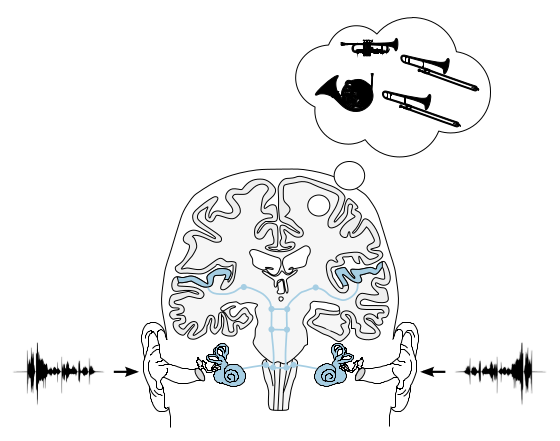

**Figure 1.1**: The human auditory system. The two ear signals are processed
by the outer, middle, and inner ear. In
the inner ear they are transformed into
neuronal signals which are then analyzed at different interlinked stations
in the brain. The interlinking of both
ear signals already happens at a low
level in the brainstem. In the brain
itself a representation of the external
ear signals in the form of an auditory
scene is the final stage. This figure
is based on B. Grothe, M. Pecka, and
D. McAlpine. “Mechanisms of Sound
Localization in Mammals”. Physiological Reviews 90 (2010), pp. 983–1012;
K. Talbot et al. “Synaptic dysbindin-1 reductions in schizophrenia occur in
an isoform-specific manner indicating
their subsynaptic location.” PLoS ONE
6.3 (2011), e16886; L. Chittka and A.
Brockmann. “Perception space–the final frontier.” PLoS Biology 3.4 (2005),
e137.

## Steps for reproduction

The time-amplitude plot of the speech signal used for illustration in the figure
can be recreated with
```Bash
$ gnuplot speech.gnu
```
