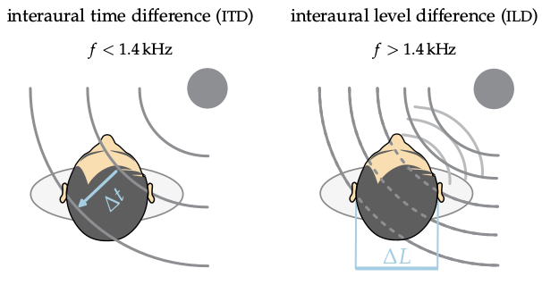

**Figure 1.2**: Interaural differences occur
between both ear signals for sources to
the side of the listener. For low frequencies ITDs are the dominant cue, for
high frequencies ILDs are more reliable.
The figure is based on B. Grothe, M.
Pecka, and D. McAlpine. “Mechanisms
of Sound Localization in Mammals”.
Physiological Reviews 90 (2010), pp. 983–1012
