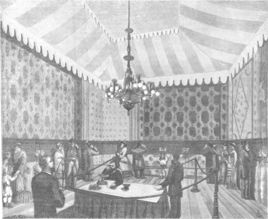

**Figure 1.3**: Setup of stereophonic telephones at the exhibition 1881 in Paris.
Figure from T. du Moncel. “The international exhibition and congress of
electricity at Paris”. Nature October 20
(1881), pp. 585–89
