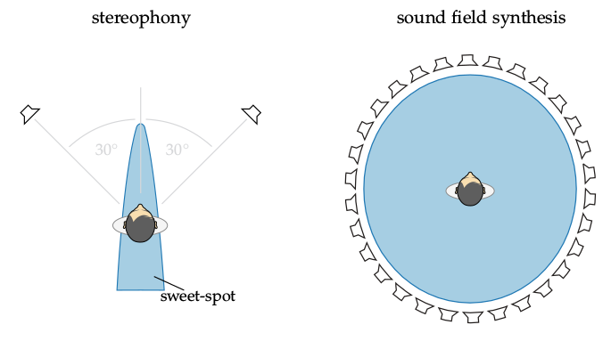

**Figure 1.4**: Loudspeaker setups for two channel stereophony and sound field
synthesis. The area marked in blue describes the positions were the listener can
move to and still perceives the same spatial impression. This area is smaller
for stereophonic setups and is called the sweet-spot. The figure of the
stereophony setup is a modified version of J. Ahrens. Analytic Methods of Sound
Field Synthesis. New York: Springer, 2012, Fig. 1.1.

## Steps for reproduction

The actual text is rendered into the figure using tikz. You can recreate the
final figure from the sketch files `src/sfs.pdf` and `src/stereo.pdf` and the
LaTeX file `src/fig1_04.tex` by running the following in a bash:

```Bash
$ gnuplot fig1_04.plt
```
