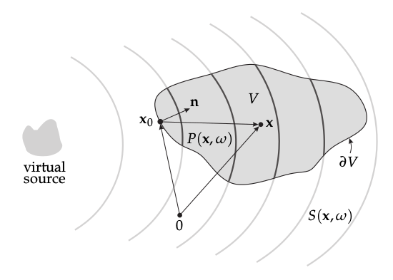

**Figure 2.1**: Illustration of the geometry used to discuss the physical
fundamentals of sound field synthesis and the single-layer potential (2.1).

## Steps for reproduction

The actual text is rendered into the figure using tikz. You can recreate the
final figure from the sketch file `src/kirchhoff_helmholtz_integral.pdf` and the
LaTeX file `src/fig2_01.tex` by running the following in a bash:

```Bash
$ gnuplot fig2_01.plt
```
