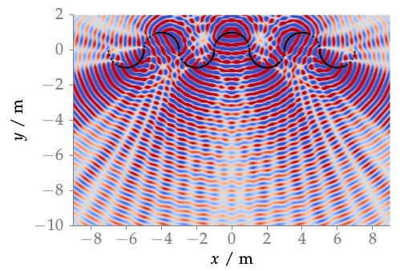

**Figure 2.2**: Sound pressure of a point source synthesized with WFS (2.62).
The secondary source distribution is shown in black, whereby inactive sources
are marked with a dashed line. Parameters: x_s = (0,2.5,0) m, x_ref = (0,-3,0)
m, f = 700 Hz.

## Steps for reproduction

Matlab/Octave:
```Matlab
>> fig2_02
```

Bash:
```Bash
$ gnuplot fig2_02.plt
```
