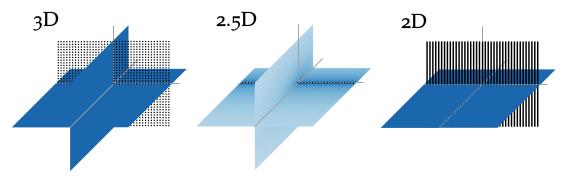

**Figure 2.3**: Sound pressure in decibel for secondary source distributions
with different dimensionality all driven by the same signals. The sound pressure
is color coded, lighter color corresponds to lower pressure. In the 3D case a
planar distribution of point sources is applied, in the 2.5D case a linear
distribution of point sources, and in the 2D case a linear distribution of line
sources.

## Steps for reproduction

The final figure was arranged in Inkscape and saved as
`src/sound_field_dimensionality.pdf`. The parts contributing to the final figure
where actual sound field plots, which you can generate by the following command.

Matlab/Octave:
```Matlab
>> fig2_03_parts
```

Bash:
```Bash
$ gnuplot fig2_03_parts.plt
```

The actual text is rendered into the figure using tikz. You can recreate the
final figure from the sketch file `src/sound_field_dimensionality.pdf` and the
LaTeX file `src/fig2_03.tex` by running the following in a bash:

Bash:
```Bash
$ gnuplot fig2_03.plt
```
