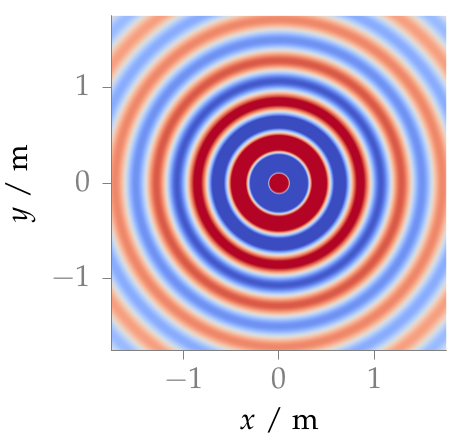

**Figure 2.5**: Sound pressure for a monochromatic point source (2.35) placed at
(0,0,0). Parameters: f = 800 Hz.

## Steps for reproduction

Matlab/Octave:
```Matlab
>> fig2_05
```

Bash:
```Bash
$ gnuplot fig2_05.plt
```
