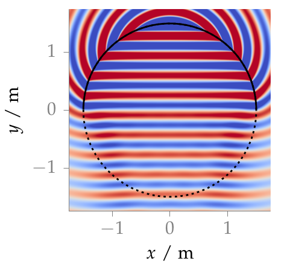

**Figure 2.9**: Sound pressure for a monochromatic plane wave synthesized by
2.5D WFS (2.55).  Parameters: n_k = (0,−1,0), x_ref = (0,0,0), f = 1 kHz.

## Steps for reproduction

Matlab/Octave:
```Matlab
>> fig2_09
```

Bash:
```Bash
$ gnuplot fig2_09.plt
```
