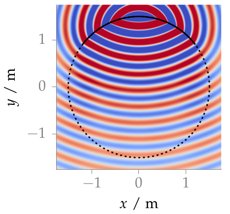

**Figure 2.10**: Sound pressure for a monochromatic point source synthesized by
2.5D WFS (2.62).  Parameters: x_s = (0,2.5,0) m, x_ref = (0,0,0), f = 1 kHz.

## Steps for reproduction

Matlab/Octave:
```Matlab
>> fig2_10
```

Bash:
```Bash
$ gnuplot fig2_10.plt
```
