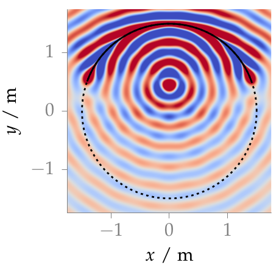

**Figure 2.12**: Sound pressure of a mono-frequent focused source synthesized
with 2.5D WFS (2.74). Parameters: x_s = (0,0.5,0) m, n_s = (0,−1,0),
x_ref = (0,0,0), f = 1 kHz.

## Steps for reproduction

Matlab/Octave:
```Matlab
>> fig2_12
```

Bash:
```Bash
$ gnuplot fig2_12.plt
```
