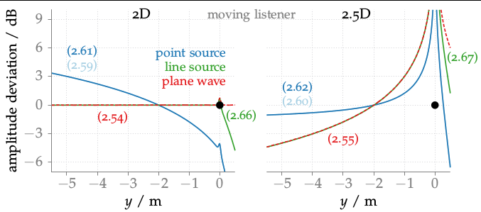

**Figure 3.1**: Amplitudes of sources synthesized via WFS minus the amplitudes
of corresponding real sources dependent on the listener’s position along the
y-axis. A source is synthesized correctly if its amplitude deviation is 0 dB. An
infinite linear secondary source distribution located on the x-axis was used,
indicated by the black dot. A comparison between 2D and 2.5D synthesis is shown,
with the reference point at x_ref = (0,−2,0) m for the 2.5D case. The used
driving functions are given within the figure. Parameters: f = 1 kHz.

## Steps for reproduction

Matlab/Octave:
```Matlab
>> amplitudes_2D
>> amplitudes_25D
```
Note that the above two commands will need some time (~2 h) to finish.

Bash:
```Bash
$ gnuplot fig3_01.plt
```
