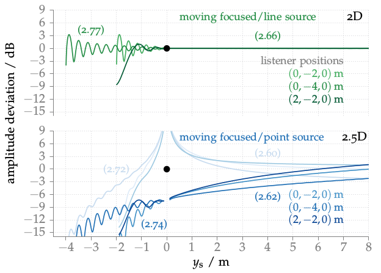

**Figure 3.2**: Amplitudes of a synthesized point/focused source minus the
amplitudes of corresponding real point source located at y_s for three fixed
listening positions. The secondary source distribution is located on the x-axis
as indicated by the black dot. For positions of the synthesized source with
negative y_s values the corresponding focused source models were applied. The
used driving functions are indicated within the graphs. For the 2.5D case, two
different driving functions are shown whereby the dark blue one is used as
default in this thesis. Parameters: x_ref = (0,−2,0) m, f = 1 kHz.

## Steps for reproduction

Matlab/Octave:
```Matlab
>> amplitudes_moving_source_2D
>> amplitudes_moving_source_25D
>> amplitudes_moving_source_25D_ps
```

Bash:
```Bash
$ gnuplot fig3_02.plt
```
