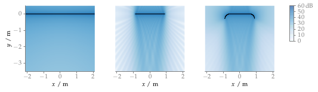

**Figure 3.3**: Sound pressure in decibel of a plane wave synthesized with
2.5D WFS (2.55). The result of an
infinite linear secondary source distribution is compared with two truncated
ones. Parameters: n_k = (0,−1,0),
x_ref = (0,−2,0) m f = 3 kHz.

## Steps for reproduction

Matlab/Octave:
```Matlab
>> sound_field_truncation
```

Bash:
```Bash
$ gnuplot sound_field_truncation.gnu
```
