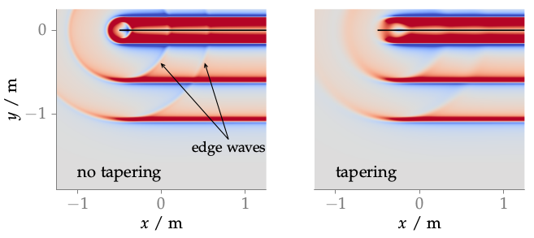

**Figure 3.4**: Sound pressure of three co-
sine shaped broad-band pulses synthesized as plane waves with WFS (2.57).
Additional edge waves are visible due
to diffraction. By applying a tapering window to the last 30 cm of the
secondary source distribution the edge
waves could be damped, as is shown
in the right graph. Parameters: x_s =
(0,−1,0), x_ref = (4.5,−2,0) m, t =
4.6 ms.

## Steps for reproduction

Matlab/Octave:
```Matlab
>> sound_field_simulations_imp_tapering
```

Bash:
```Bash
$ gnuplot sound_field_simulations_imp_tapering.gnu
```
