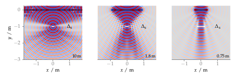

**Figure 3.6**: Sound pressure of a focused source synthesized with 2.5D WFS
(2.74). Three different linear secondary source distributions were applied,
ranging from 10 m to 0.75 m. In white the size of the focal point as given by
∆s, linear is indicated. Parameters: x_s = (0,−1,0) m, x_ref = (0,−2,0) m,
f = 2000 Hz.

## Steps for reproduction

Matlab/Octave:
```Matlab
>> fig3_06
```

Bash:
```Bash
$ gnuplot fig3_06.plt
```
