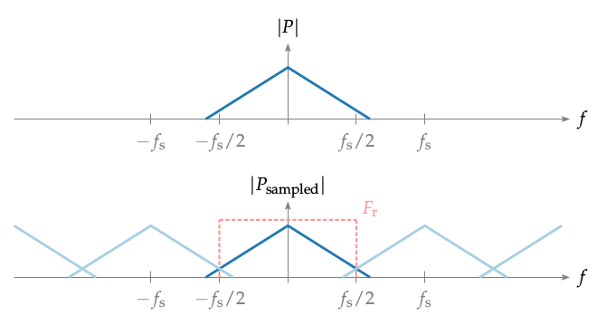

**Figure 3.7**: Magnitude of a continuous
signal P and the same signal sampled
with a sampling frequency of f_s . The
light blue lines indicate components occurring due to the sampling process. F_r
describes an ideal reconstruction filter
for the sampled signal.

## Steps for reproduction

Bash:
```Bash
$ gnuplot sampling.gnu 
```
