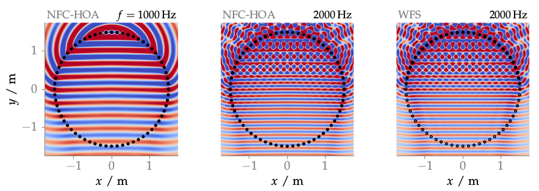

**Figure 3.8**: Sound pressure of a plane
wave synthesized by NFC-HOA (2.45)
and WFS (2.55) for different frequencies.
For WFS the open circles indicate inactive secondary sources. Parameters:
x_s = (0,−1,0), x_ref = (0,0,0) m, 64 secondary sources

## Steps for reproduction

Matlab/Octave:
```Matlab
>> sound_field_aliasing
```

Bash:
```Bash
$ gnuplot sound_field_aliasing.gnu
```
