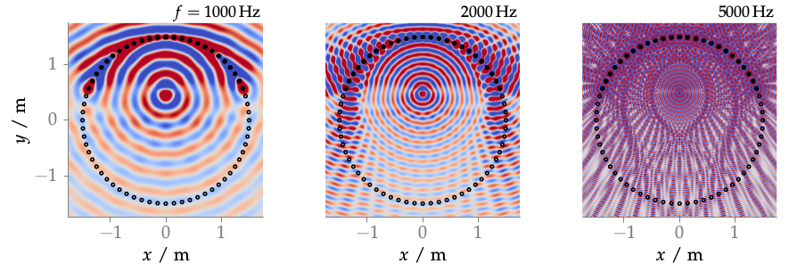

**Figure 3.9**: Sound pressure of a focused source synthesized by WFS (2.74)
for different frequencies. Parameters:
x_s = (0,0.5,0), x_ref = (0,0,0) m, 64 secondary sources.

## Steps for reproduction

Matlab/Octave:
```Matlab
>> sound_field_aliasing_fs
```

Bash:
```Bash
$ gnuplot sound_field_aliasing_fs.gnu
```
