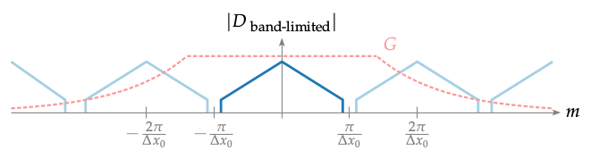

**Figure 3.10**: Magnitude of a mono-frequent,
spatial band-limited NFC-HOA driving function.
The light blue lines indicate components
occurring due to the sampling process.
G describes the reconstruction filter.

## Steps for reproduction

Bash:
```Bash
$ gnuplot sampling_bandlimited.gnu
```
