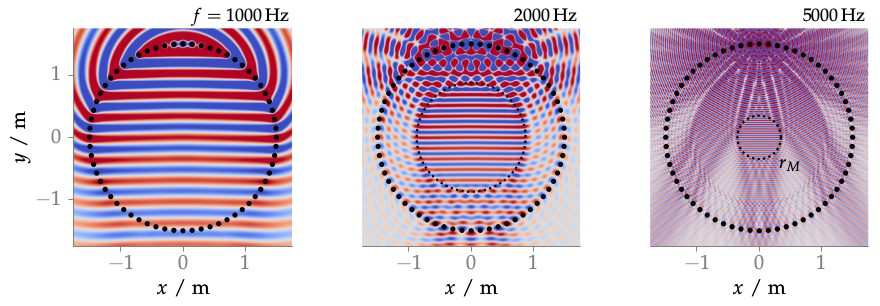

**Figure 3.11**: Sound pressure of a plane wave synthesized by NFC-HOA (2.45)
for different frequencies. The maximum order M was set to be 32 after (3.5).
The region of correct synthesis is given by r_M = Mc/ω as indicated by the
dotted line. Parameters: x_s = (0,−1,0), x_ref = (0,0,0) m, 64 secondary
sources.

## Steps for reproduction

Matlab/Octave:
```Matlab
>> fig3_11
```

Bash:
```Bash
$ gnuplot fig3_11.plt
```
