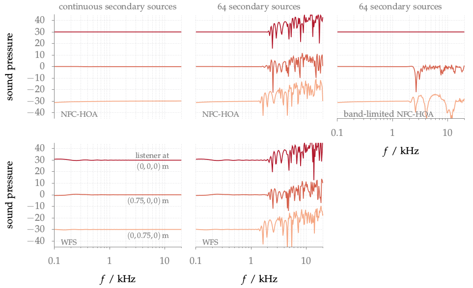

**Figure 3.12**: Sound pressure in decibel of a plane wave synthesized by
NFC-HOA (2.45) and WFS (2.55). Mono-frequent simulations were done for all
frequencies at three different listening
positions. A fixed offset was added
to the amplitudes for two of the positions for better visualization.
Parameters: x_s = (0,−1,0), x_ref = (0,0,0) m,
circular secondary source distribution
with a diameter of 3 m.

## Steps for reproduction

Matlab/Octave:
```Matlab
>> freq_response
```
Note that the calculation will take several hours.

Bash:
```Bash
$ gnuplot freq_response.gnu
```
