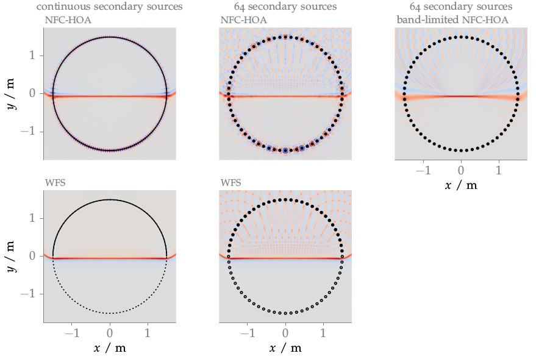
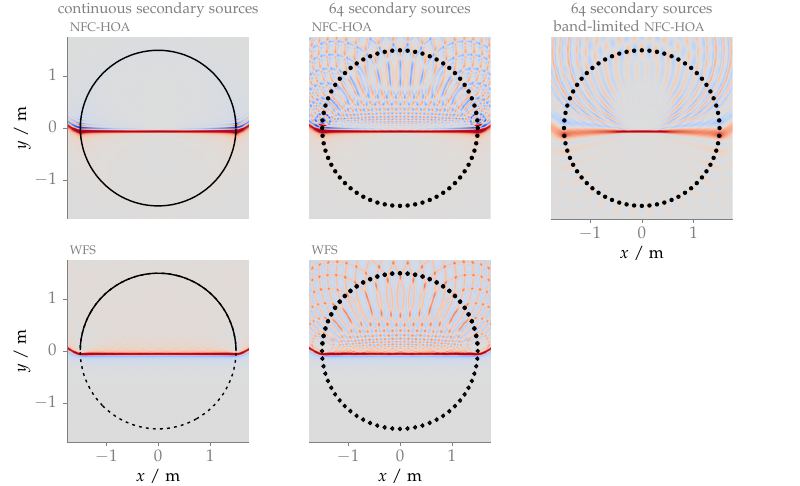

**Figure 3.13**: Sound pressure of a cosine shaped impulse synthesized as a
plane wave by NFC-HOA (2.45) and WFS (2.57). Parameters: n_k = (0,−1,0),
x_ref = (0,0,0), t = 4.6 ms, 64 secondary sources for the sampled distributions.

## Errata

With [release 2.4.0] of the SFS Toolbox for Matlab the numerical problems
apparent in the above figure could be resolved ([code to reproduce this
figure]). 



[release 2.4.0]: http://dx.doi.org/10.5281/zenodo.846583
[code to reproduce this figure]: https://github.com/hagenw/phd-thesis/tree/sfs-2.4/03_sound_field_errors_and_their_perceptual_relevance/fig3_13

## Steps for reproduction

Matlab/Octave:
```Matlab
>> fig3_13
```
The above command will need an internet connection as it will download mat-files
containing zeroing of Bessel functions of higher orders.

The results for the non-band-limited NFC-HOA graphs include numerical artifacts
around the secondary sources. This cannot be reproduced with current Matlab and
Octave versions. This highlights that the errors are really numerical in the
thesis and not part of the NFC-HOA solution.

Bash:
```Bash
$ gnuplot fig3_13.plt
```

## Problem solving

If you run the above command in Octave it could happen that you get an error
like
```
error: zp2sos: A(I,J): row index out of bounds; value 1 out of bound 0
```
This happens if you have a new version of the `zp2sos` Octave Forge function
installed. The problem was introduced with [commit
f248ba](http://sourceforge.net/p/octave/signal/ci/f248ba3244150e69e576d898161d8a0a8892b7c3/).
This error can be solved if you change line 105 in
`driving_function_imp_nfchoa_pw.m` of the Sound Field Synthesis Toolbox from
```Matlab
sos = zp2sos(p,z*c/R,2,'down','none');
```
to
```Matlab
[sos,~] = zp2sos(p,z*c/R,2,'down','none');
```
The same solution holds for Fig. 3.14, Fig. 3.15.
