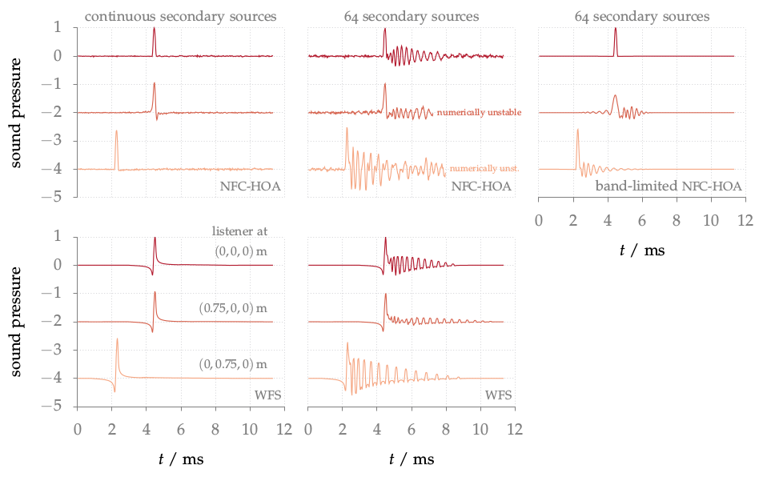

**Figure 3.14**: Sound pressure of cosine shaped impulse synthesized as a plane
wave by NFC-HOA (2.45) and WFS (2.57) at three different listening positions. A
fixed offset was added to the sound pressure at two listening positions for a
better visualization. Parameters: n_k = (0,−1,0), x_ref = (0,0,0), circular
secondary source distribution with a diameter of 3 m.

## Steps for reproduction

Matlab/Octave:
```Matlab
>> fig3_14
```

Bash:
```Bash
$ gnuplot fig3_14.plt
```

## Problem solving

If you run the above command in Octave it could happen that you get an error
like
```
error: zp2sos: A(I,J): row index out of bounds; value 1 out of bound 0
```
This happens if you have a new version of the `zp2sos` Octave Forge function
installed. The problem was introduced with [commit
f248ba](http://sourceforge.net/p/octave/signal/ci/f248ba3244150e69e576d898161d8a0a8892b7c3/).
This error can be solved if you change line 105 in
`driving_function_imp_nfchoa_pw.m` of the Sound Field Synthesis Toolbox from
```Matlab
sos = zp2sos(p,z*c/R,2,'down','none');
```
to
```Matlab
[sos,~] = zp2sos(p,z*c/R,2,'down','none');
```
The same solution holds for Fig. 3.13, Fig. 3.15.
