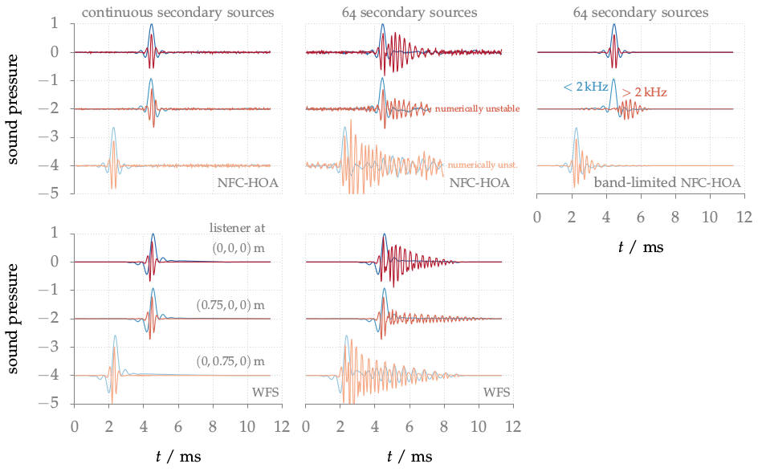
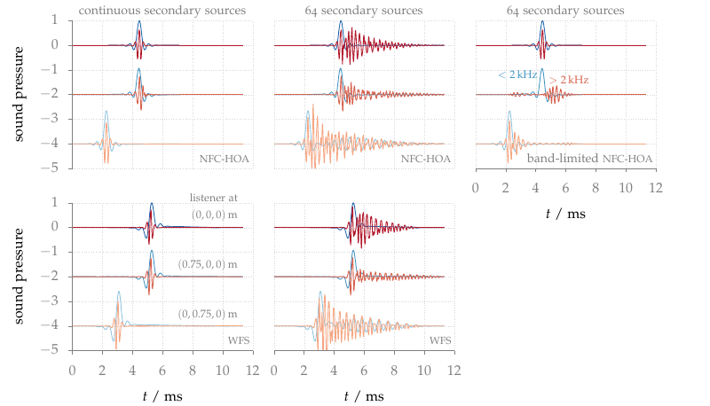

**Figure 3.15**: Sound pressure of a low and high-frequency cosine shaped
impulse synthesized as plane wave by NFC-HOA (2.45) and WFS (2.57) at three
listening positions. A fixed offset was added to the sound pressure at two
listening positions for a better visualization. The low-frequency impulses are
presented in blue, the high-frequency impulses in red. Parameters: x_s =
(0,−1,0), x_ref = (0,0,0) m, circular secondary source distribution with a
diameter of 3 m.

## Errata

With [release 2.4.0] of the SFS Toolbox for Matlab the numerical problems
apparent in the above figure could be resolved ([code to reproduce this
figure]). 



[release 2.4.0]: http://dx.doi.org/10.5281/zenodo.846583
[code to reproduce this figure]: https://github.com/hagenw/phd-thesis/tree/sfs-2.4/03_sound_field_errors_and_their_perceptual_relevance/fig3_15

## Steps for reproduction

Matlab/Octave:
```Matlab
>> fig3_15
```

Bash:
```Bash
$ gnuplot fig3_15.plt
```

## Problem solving

If you run the above command in Octave it could happen that you get an error
like
```
error: zp2sos: A(I,J): row index out of bounds; value 1 out of bound 0
```
This happens if you have a new version of the `zp2sos` Octave Forge function
installed. The problem was introduced with [commit
f248ba](http://sourceforge.net/p/octave/signal/ci/f248ba3244150e69e576d898161d8a0a8892b7c3/).
This error can be solved if you change line 105 in
`driving_function_imp_nfchoa_pw.m` of the Sound Field Synthesis Toolbox from
```Matlab
sos = zp2sos(p,z*c/R,2,'down','none');
```
to
```Matlab
[sos,~] = zp2sos(p,z*c/R,2,'down','none');
```
The same solution holds for Fig. 3.13, Fig. 3.14.
