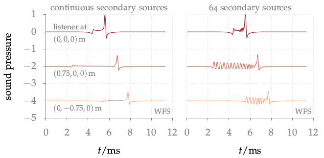

**Figure 3.16**: Sound pressure of a
cosine shaped impulse synthesized as
focused source by WFS (2.76) at three
listening positions. A fixed offset was
added to the sound pressure at two
listening positions for a better
visualization. Parameters: x_s = (0,0.5,0) m,
n_s = (0,−1,0), circular secondary
source distribution with a diameter of
3 m.

## Steps for reproduction

Matlab/Octave:
```Matlab
>> sound_field_time_fixed_fs
```

Bash:
```Bash
$ gnuplot sound_field_time_fixed_fs.gnu
```
