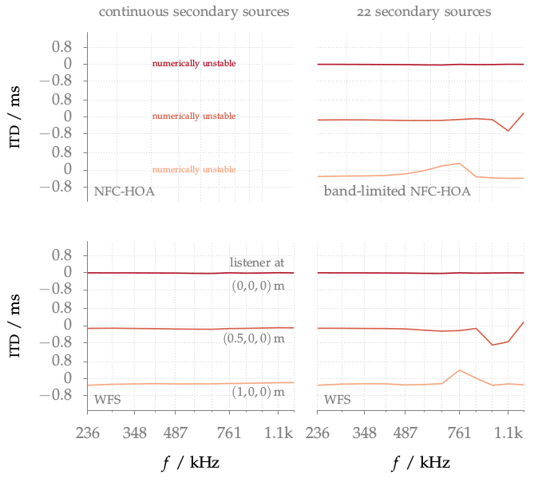

**Figure 3.17**: ITDs for a pink noise
signal synthesized as a point source by
NFC-HOA (2.45) and WFS (2.57) at three
listening positions, with a head
orientation of 90°. Parameters: x_s =
(0,2.5,0), x_ref = (0,0,0), circular
secondary source distribution with a
diameter of 3 m.

## Steps for reproduction

Matlab/Octave:
```Matlab
>> sfs_itd
```

Bash:
```Bash
$ gnuplot sfs_itd.gnu
```

## Problem solving

If you run the above command in Octave it could happen that you get an error
like
```
error: zp2sos: A(I,J): row index out of bounds; value 1 out of bound 0
```
This happens if you have a new version of the `zp2sos` Octave Forge function
installed. The problem was introduced with [commit
f248ba](http://sourceforge.net/p/octave/signal/ci/f248ba3244150e69e576d898161d8a0a8892b7c3/).
This error can be solved if you change line 106 in
`driving_function_imp_nfchoa_ps.m` of the Sound Field Synthesis Toolbox from
```Matlab
sos = zp2sos(z*c/r,z*c/R,1,'up','none');
```
to
```Matlab
[sos,~] = zp2sos(z*c/r,z*c/R,1,'up','none');
```
