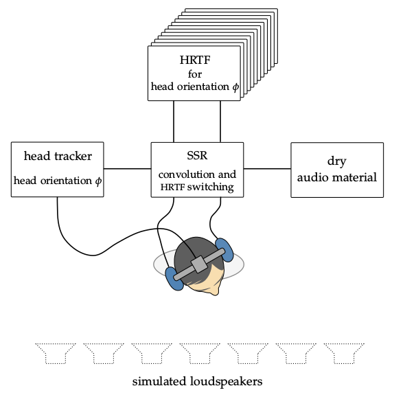

**Figure 4.1**: Functional principle of
dynamic binaural synthesis. The listener
is wearing headphones and a head
tracker. The audio material is
convolved with the HRTF that incorporates
all simulated loudspeakers for the
corresponding listener orientation.
