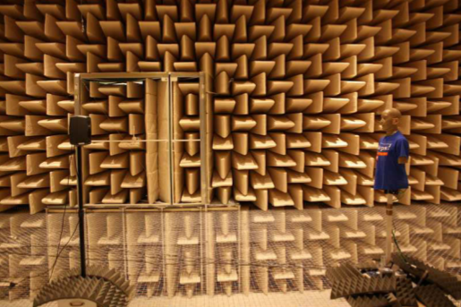

**Figure 4.2**: Measurements with the artificial head in the anechoic chamber.

The measurements are available in the SOFA format at
[doi:10.5281/zenodo.55418](http://dx.doi.org/10.5281/zenodo.55418). If you want
to use them directly with the SFS Toolbox version used during the time of
writing the dissertation you have to download the [irs-versions of the
files](https://dev.qu.tu-berlin.de/projects/measurements/repository/show/2010-11-kemar-anechoic/mat).
