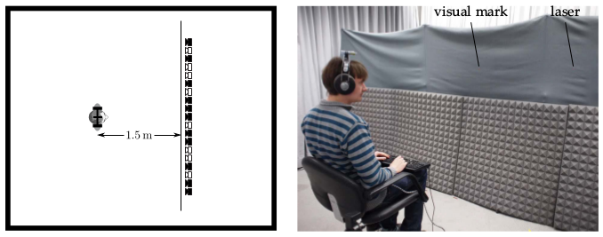

**Figure 4.3**: Sketch of the apparatus in the listening room (left) and a
listener during the experiment (right). Only the loudspeakers marked in black
were used in the experiment. Note that the room was dark during the experiment.

## Steps for reproduction

The figure is a combination of the sketch ``src/apparatus.pdf`` and the image
``procedure.jpg``, which is annotated by ``src/fig4_03.tex``. In order to
regenerate it run the following in bash:

```Bash
$ gnuplot fig4_03.plt
```
