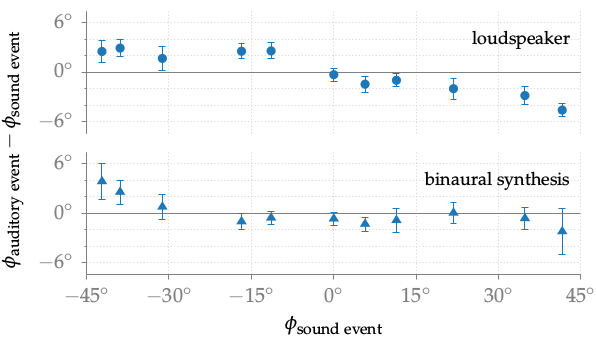

**Figure 4.4**: Difference between the
direction of the auditory event and the
sound event for loudspeakers and the
binaural simulation of the
loudspeakers. Average over all listeners together
with the 95% confidence interval is
shown.

## Steps for reproduction

Bash:
```Bash
$ gnuplot binaural_results
```
