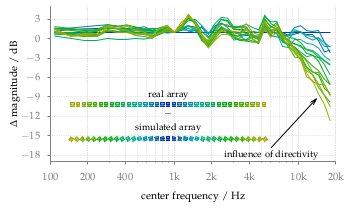

**Figure 4.6**: Difference between the magnitude of the simulated and real
loudspeaker array dependent on the center frequency of the auditory filter bank.

## Steps for reproduction

Bash:
```Bash
$ gnuplot fig4_06.plt
```

If you want to do the Matlab/Octave calculation as well, you first have to
download the corresponding impulse responses from [10.5281/zenodo.55421](http://dx.doi.org/10.5281/zenodo.55421)
and store them in the `fig4_06` folder. After that you can run in Matlab/Octave:
```Matlab
>> fig4_06
```
