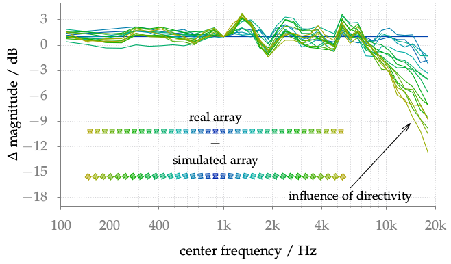

**Figure 4.6**: Difference between the
magnitude of the simulated and real
loudspeaker array dependent on the center
frequency of the auditory filter bank.

## Steps for reproduction

Bash:
```Bash
$ gnuplot array_directivity.gnu
```

If you want to do the Matlab/Octave calculation as well, you first have to
download the corresponding impulse responses from the [Impulse Response
Measurements
repository](https://dev.qu.tu-berlin.de/projects/measurements/repository/show/2011-09-kemar-anechoic-loudspeaker-array/mat)
and store them in the `fig4_06` folder. After that you can run in Matlab/Octave:
```Matlab
>> array_directivity
```
