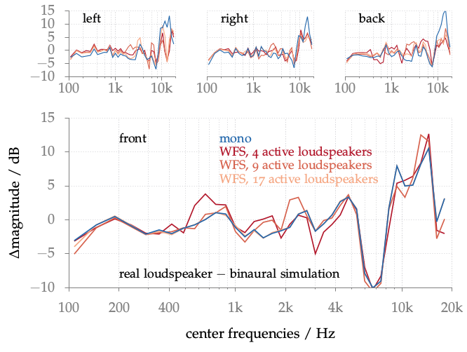

**Figure 4.9**: Differences in magnitude
between real loudspeaker setups and
their binaural simulation. A single
loudspeaker (mono) or a circular
loudspeaker array driven by WFS was
applied to synthesize a point source in the
front, left, right, or back of the listener.

## Steps for reproduction

Bash:
```Bash
$ gnuplot pinta_recordings
```

If you want to do also the recalculation using Matlab/Octave you first have to
download the binaural recordings from the [Impulse Response Measurements
repository](https://dev.qu.tu-berlin.de/projects/measurements/repository/show/2012-01-kemar-pinta-vs-brir-recordings/wav).
Afterwards run the following in Matlab/Octave:
```Matlab
>> pinta_recordings
```
