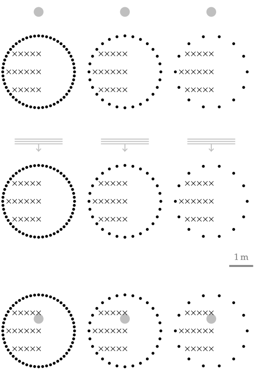

**Figure 5.2**: Setup for Experiment 2. The
position of the synthesized source is
indicated by the grey point. The position
of the listener by black crosses and
secondary sources by black dots.

## Steps for reproduction

Bash:
```Bash
$ gnuplot wfs_circular_array.gnu
```
