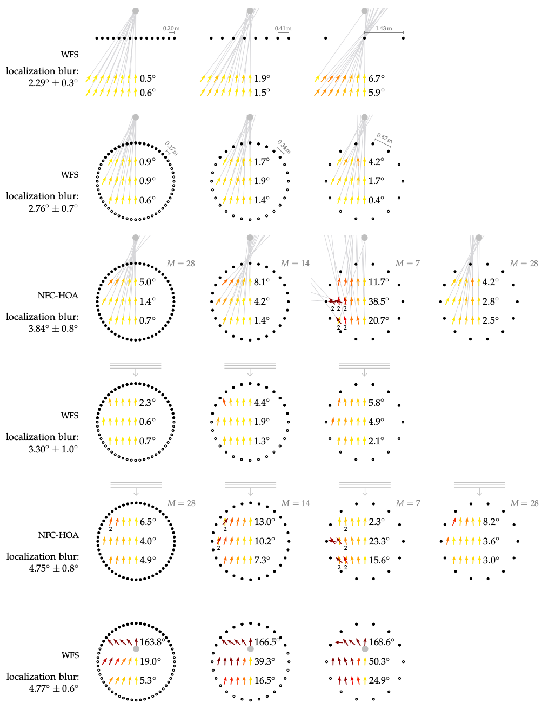

**Figure 5.4**: Average localization
results for all four experiments. The
black symbols indicate loudspeakers,
the grey ones the synthesized source.
At every listening position, an arrow is
pointing into the direction from which
the listeners perceived the
corresponding auditory event. The color of the
arrow displays the absolute localization
error, which is also summarized as an
average beside the arrows for every row
of positions. The average confidence
interval for all localization results is 2.3°.
Listening conditions which resulted in
listeners saying that they perceived two
sources in Exp. 4 are highlighted with a
small 2 written below the position.

## Steps for reproduction

In order to reproduce the figure from the mean data that is stored in this
directory run in Bash:
```Bash
$ gnuplot sfs_localization.gnu
```

The data of the single listeners for the four different experiments presented
together in this figure are stored in the sub-directories `data_wfs_linear`,
`data_wfs_circular`, `data_hoa_circular`, `data_hoa_circular_number_of_sources`.
If you enter them you will find scripts that show how the mean values were
calculated from the single listener results. For example for the case of WFS and
a linear loudspeaker array you have to do the following in Octave (the scripts
are working only in Octave at the moment due to another different handling of
the `dlmread` function in Matlab and Octave):
```Matlab
>> cd data_wfs_linear
>> results_wfs_ps_linear
```
This will then override the result files in the main directory.

In the case of NFC-HOA, the two functions `results_nfchoa_ps_two_directions`,
and `results_nfchoa_pw_two_directions` run a Gaussian mixture model and for the
listener positions, at which a visual inspection of the distribution of answers
from the listener indicated more than one underlying distribution. The functions
output the distributions as figures and print out the estimated directions for
the two perceived sources.
Note, that the results will not be automatically inserted into the result files
in the main directory and the resulting plot will only present the mean results
assuming always a single perceived direction. If you want to include the results
for two perceived directions you have to do it manually.
