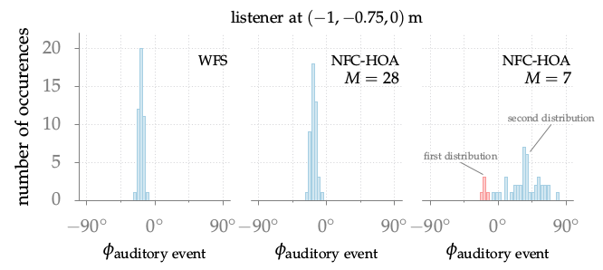

**Figure 5.5**: Distributions of the directions of the auditory event as rated
by the listeners at the position (−1,−0.75,0) m for the loudspeaker array with
14 loudspeakers. The results for a synthesized point source for WFS and NFC-HOA
for different orders M are shown. For WFS only the results for the first 9
listeners were analyzed to have an equal number of answers as in the case for
NFC-HOA .

## Steps for reproduction

Bash:
```Bash
$ gnuplot fig5_05.plt
```
