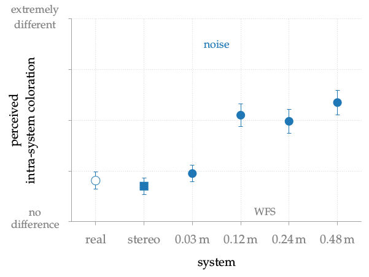

**Figure 5.6**: Average results with confidence intervals for the following
question: Is there a timbral difference between the reference and the stimulus?
Whereby the reference and the other stimuli were presented by the same system
each time, leading to the measurement of intra-system coloration.  The average
is calculated over all subjects and the different positions of the sources. All
loudspeakers, including real, stereo, and WFS, were simulated via binaural
synthesis. The results are replotted from H. Wittek. “Perceptual differences
between wavefield synthesis and stereophony”. PhD thesis.  University of Surrey,
2007, Fig. 8.6.

## Steps for reproduction

Bash:
```Bash
$ gnuplot fig5_06.plt
```
