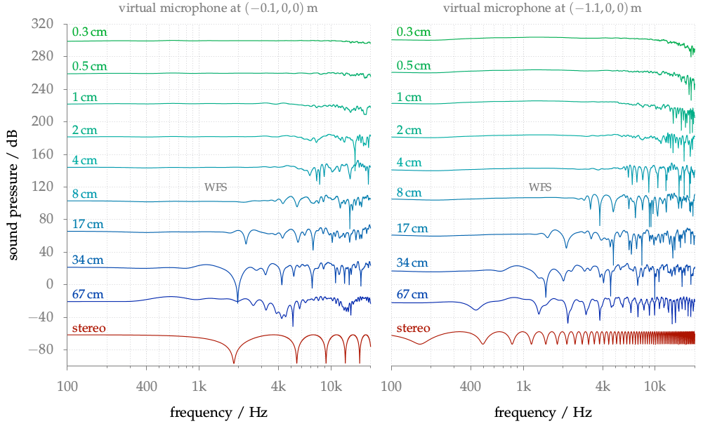

**Figure 5.8**: Amplitude spectra for the
varying secondary source distribution
conditions.
The spectra was simulated for the place
of the left ear of
the listener. The left graph shows the
spectra for the central listening
position, the right for the off-center
position. The distance between the
secondary sources is given for all WFS
spectra. The spectra are shifted in
absolute magnitude in order to
meaningfully display them. Parameters: x_s =
(0,2.5,0), x_ref = (0,0,0) m, circular
secondary source distribution with a
diameter of 3 m.

## Steps for reproduction

Bash:
```Bash
$ gnuplot freq_response_coloration.gnu
```

If you want to recalculate the frequency responses yourself, you have to run the
following commands in Matlab/Octave before running gnuplot:
```Matlab
>> cd matlab
>> freqresp_WFS_center
>> freqresp_WFS_offcenter
```
This will override the txt-files in the main directory.
