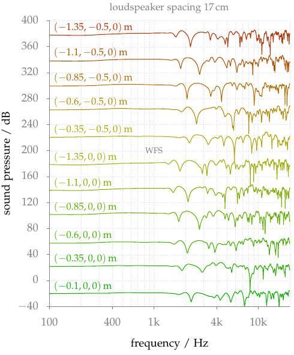

**Figure 5.9**: Amplitude spectra for WFS and a fixed secondary source
distribution. The spectra are simulated for different positions as indicated by
the colored labels in the figure. The spectra are shifted in absolute magnitude
in order to display them. Parameters: x_s = (0,2.5,0), x_ref = (0,0,0), circular
secondary source distribution with a diameter of 3 m.

## Errata

By setting the sampling rate to 48000 Hz and using a fractional delay filter the
frequency responses look slightly different for high frequencies ([code to
reproduce this figure]).



[code to reproduce this figure]: https://github.com/hagenw/phd-thesis/tree/sfs-2.4/05_psychoacoustics/fig5_09

## Steps for reproduction

Bash:
```Bash
$ gnuplot fig5_09.plt
```

If you want to recalculate the frequency responses yourself, you have to run the
following commands in Matlab/Octave before running gnuplot:
```Matlab
>> cd ../fig5_08/matlab
>> freqresp_WFS_moving_listener
```
This will override the txt-file in the `data` directory.
