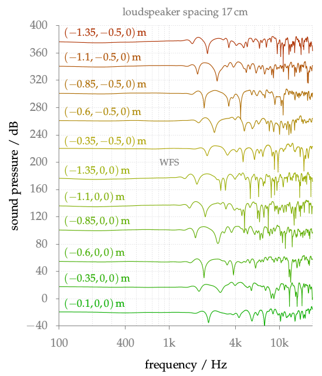

**Figure 5.9**: Amplitude spectra for WFS
and a fixed secondary source
distribution. The spectra are simulated for
different positions as indicated by the
colored labels in the figure. The
spectra are shifted in absolute magnitude
in order to display them. Parameters:
x_s = (0,2.5,0), x_ref = (0,0,0),
circular secondary source distribution with
a diameter of 3 m.

## Steps for reproduction

Bash:
```Bash
$ gnuplot freq_response_coloration_moving.gnu
```

If you want to recalculate the frequency responses yourself, you have to run the
following commands in Matlab/Octave before running gnuplot:
```Matlab
>> cd ../fig5_08/matlab
>> freqresp_WFS_moving_listener
```
This will override the txt-file in the main directory.
