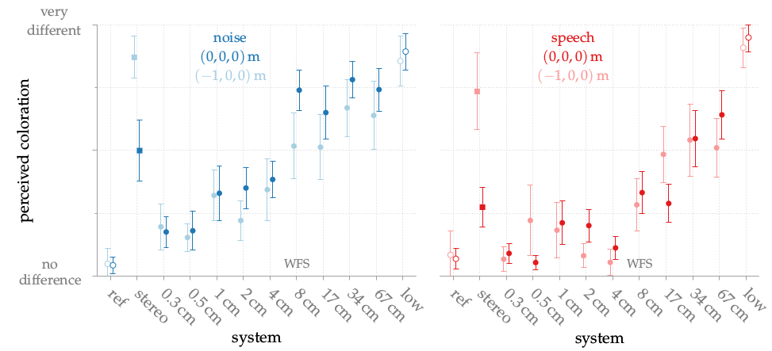
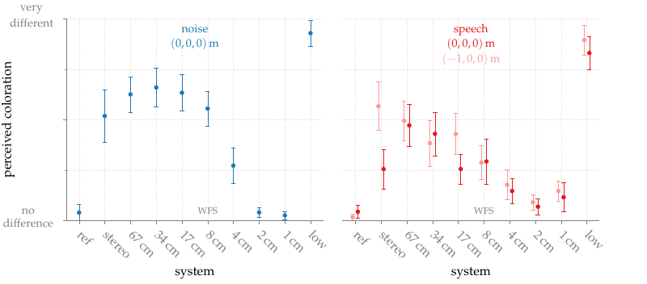

**Figure 5.10**: Average results with confidence intervals for the perceived
coloration. Dark colors show results for the central listening position, lighter
colors for the off-center position.

## Errata

The experiment was repeated by setting the sampling rate to 48000 Hz and using a
fractional delay filter, see errata of [Fig. 5.8] ([code to reproduce this
figure]). 



[Fig. 5.8]: ../fig5_08
[code to reproduce this figure]: https://github.com/hagenw/phd-thesis/tree/sfs-2.4/05_psychoacoustics/fig5_10

## Steps for reproduction

Bash:
```Bash
$ gnuplot fig5_10.plt
```
