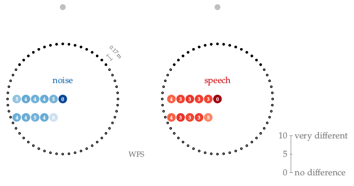

**Figure 5.11**: Perceived coloration rated with the attribute pair *very
different, no difference*. The latter corresponds to a value of 0 in the figure,
the former to a value of 10. The values are written directly at the listening
position where the listener had to rate the coloration, and are further
highlighted by a corresponding color. The average confidence interval is 1.2
over all positions.

## Steps for reproduction

Bash:
```Bash
$ gnuplot fig5_11.plt
```
