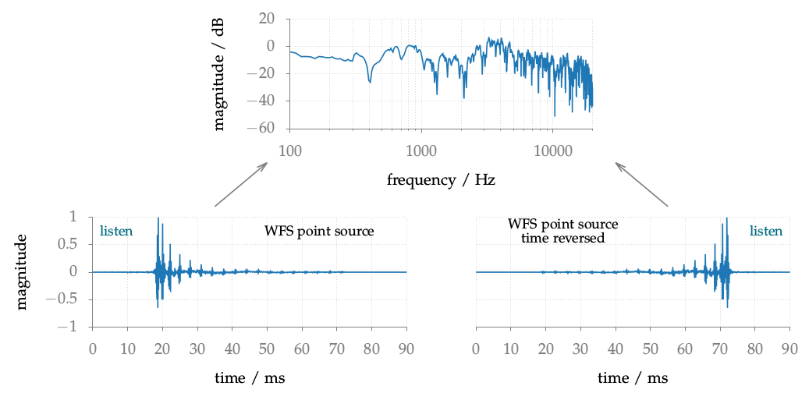

**Figure 5.12**: Impulse response and
amplitude spectrum of a point source
synthesized by WFS (2.64). Beside the im-
pulse response its time reversed
version is shown. Both impulse responses
were convolved with a speech signal
which can be downloaded via the
listen links. Parameters: x_s = (0,1,0),
x_ref = (4,−4,0) m, linear secondary
source distribution with a length of
20 m and 34 sources.

## Steps for reproduction

Matlab/Octave:
```Matlab
>> wfs_artifacts
```

Bash:
```Bash
$ gnuplot wfs_artifacts.gnu
```
