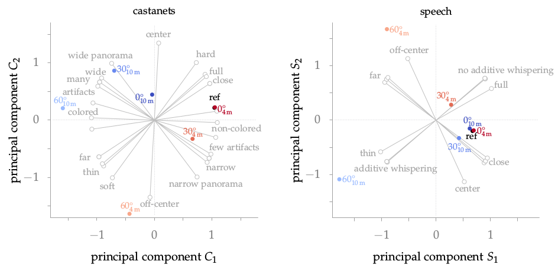

**Figure 5.14**: Principal component
analysis for castanets (left) and speech
(right) for one single subject. The blue,
red and black points indicate the
position of the conditions given in the two-
dimensional space determined by the
two given components for each
stimulus type. The gray lines show the
arrangement of the attribute pairs in these
two dimensions.

## Steps for reproduction

Bash:
```Bash
$ gnuplot pca.gnu
```
