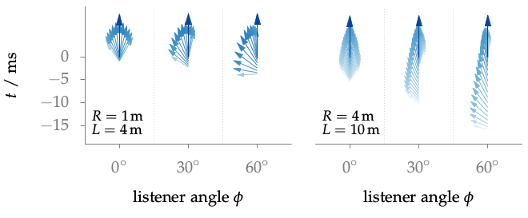

**Figure 5.15**: Direction, amplitude and time of appearance of wave fronts for
the 4 m loudspeaker array (left) and the 10 m array (right). The results are
shown for different angles φ at a radius of 1 m and 4 m, respectively. The
arrows are pointing towards the direction from which the wave fronts arrive. The
time of appearance is given by the starting point of the arrow. The length and
color of the arrow is proportional to the amplitude of the wave front in dB. The
dark blue arrows indicate the desired wave fronts.

## Steps for reproduction

Bash:
```Bash
$ gnuplot fig5_15.plt
```

Note, the magnitude and direction of the single wave fronts can be calculated
with the following function: 
https://github.com/sfstoolbox/sfs/blob/1.0.0/SFS_analysis/wave_fronts_wfs.m


