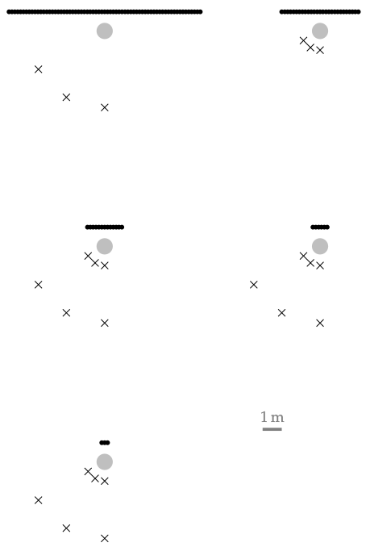

**Figure 5.16**: Setup for Experiment 2.  The position of the synthesized
focused source is indicated by the grey point.  The position of the listener by
black crosses and secondary sources by black dots.

## Steps for reproduction

Bash:
```Bash
$ gnuplot fig5_16.plt
```
