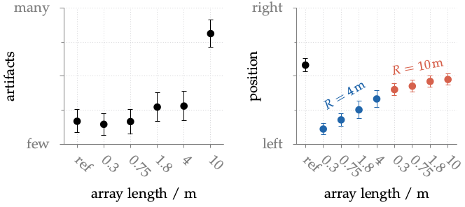

**Figure 5.17**: Mean and standard error for the rating of the attribute pair
few artifacts vs. many artifacts plotted over the condition. The mean is
calculated over all subjects, source materials and the different listener
positions.

## Steps for reproduction

Bash:
```Bash
$ gnuplot fig5_17.plt
```
