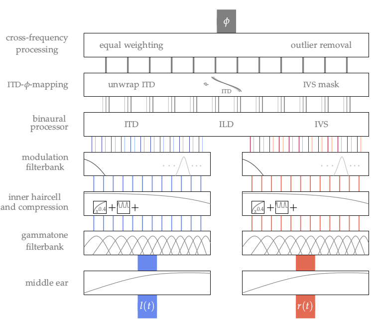

**Figure 6.1**: Sketch of the applied binaural model. At the bottom the two time
signals l(t) and r(t) are the input to the model. After that identical monaural
preprocessing is applied. The binaural processor calculates the ITD, ILD, and
interaural vector strength (IVS) based on the arriving input signals for every
frequency channel. At the end the bin- aural parameter is mapped to a single
direction estimation averaged over the whole time of the input signals.

## Steps for reproduction

Matlab/Octave:
```Matlab
>> fig6_01
```

Bash:
```Bash
$ gnuplot fig6_01
```
