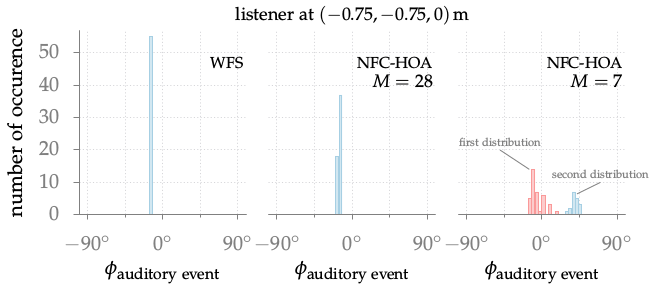

**Figure 6.2**: Distributions of the auditory
event’s directions as predicted by the
binaural model for the listening
position (−0.75,−0.75,0) m and the circular
secondary source distribution with 14
sources. The results for a synthesized
point source for WFS and NFC-HOA up
to different orders M are shown.

## Steps for reproduction

Bash:
```Bash
$ gnuplot localization_distribution.gnu
```

In order to get an idea how the model results were calculated have a look at
[Fig. 6.3](../fig6_03).
